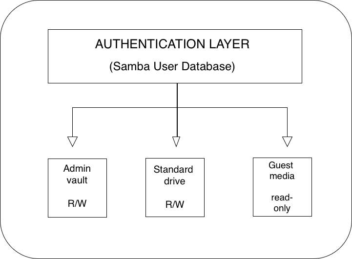
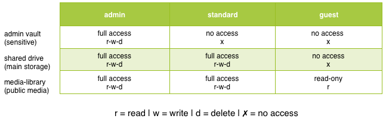

# Secure File Services & Access Control

A Samba file server configured with role-based access control, tiered Linux permissions, and least privilege enforcement, built and tested on a live lab server.

## Architecture



## Permission Matrix



## Directory Structure & Permissions


## What's Covered

- **Samba file server** with 3-tier role-based access (Admin, Standard, Guest)
- **Linux group-based permissions** with setgid inheritance for consistent ownership
- **Principle of least privilege** applied to shared storage directories
- **POSIX ACLs** for fine-grained control beyond standard Unix permissions
- **SMB protocol hardening** — enforcing SMB2/3 minimum, disabling guest access
- **Real debugging story** — diagnosing and fixing a CIFS mount permission issue

## Real-World Context

This is not a theoretical exercise. The setup runs on a live Arch Linux home server with a 7.3TB drive (`/dev/sdd1`) mounted at `/mnt/WaRlOrD`, serving files to local and VPN-connected clients. The [troubleshooting doc](docs/troubleshooting.md) covers a real permission denied bug that was debugged and fixed in production.

## Documentation

| Doc | Description |
|-----|-------------|
| [Samba Setup Guide](docs/samba-setup-guide.md) | Full step-by-step setup: drive mount, users, groups, smb.conf |
| [Permission Model](docs/permission-model.md) | Deep dive into Linux permissions, setgid, and POSIX ACLs |
| [User Tier Design](docs/user-tier-design.md) | Rationale behind the 3-tier access model |
| [Testing & Validation](docs/testing-validation.md) | How to verify every permission boundary works |
| [Troubleshooting](docs/troubleshooting.md) | Real debug report + common issues checklist |

## Quick Start

```bash
# 1. Set up groups and users
sudo bash examples/create-user-tiers.sh

# 2. Apply directory permissions
sudo bash examples/set-directory-permissions.sh

# 3. Copy the Samba config template and edit for your environment
sudo cp configs/samba/smb.conf.template /etc/samba/smb.conf
sudo nano /etc/samba/smb.conf

# 4. Validate and restart
testparm
sudo systemctl restart smb nmb
```

## Technologies

- **Samba** — SMB/CIFS file sharing
- **Linux permissions** — chmod, chown, setgid, POSIX ACLs (setfacl/getfacl)
- **Linux groups** — Role-based access via samba-admins, samba-standard, samba-guests
- **Bash** — Setup and validation scripts
- **Arch Linux** — Server OS

## Lessons Learned

- CIFS mounts default to `uid=0` (root) — always specify `uid`/`gid` matching the intended user, or files will be owned by root and inaccessible
- `valid user` (singular) is not a valid Samba parameter — only `valid users` (plural) works, and this fails silently
- The `[global]` section in `smb.conf` must come before any share definitions, or settings are ignored
- Setgid (`2xxx`) on shared directories ensures new files inherit the group, preventing permission drift over time

## Related Projects

This repo is part of a 3-part home lab security series:

1. [secure-remote-access-lab](https://github.com/Ruben0372/secure-remote-access-lab) — VPN, SSH hardening, firewall configuration
2. **secure-file-services-access-control** (this repo) — Samba file server with tiered access control
3. [security-automation-scripts](https://github.com/Ruben0372/security-automation-scripts) — Scripts to automate security operations
